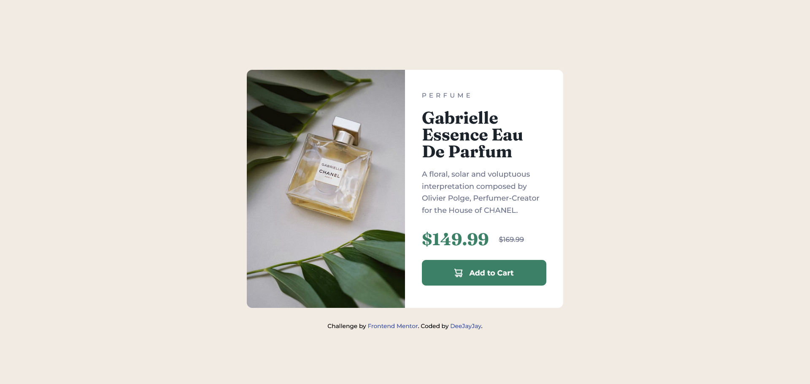

# Frontend Mentor - Product preview card component solution

This is a solution to the [Product preview card component challenge on Frontend Mentor](https://www.frontendmentor.io/challenges/product-preview-card-component-GO7UmttRfa). Frontend Mentor challenges help you improve your coding skills by building realistic projects.

## Table of contents

- [Frontend Mentor - Product preview card component solution](#frontend-mentor---product-preview-card-component-solution)
  - [Table of contents](#table-of-contents)
  - [Overview](#overview)
    - [The challenge](#the-challenge)
    - [Screenshots](#screenshots)
      - [Mobile Layout](#mobile-layout)
      - [Desktop Layout](#desktop-layout)
    - [Links](#links)
  - [My process](#my-process)
    - [Built with](#built-with)
  - [Author](#author)

## Overview

### The challenge

Users should be able to:

- View the optimal layout depending on their device's screen size
- See hover and focus states for interactive elements

### Screenshots

#### Mobile Layout

#### Desktop Layout

### Links

- [Solution URL](https://github.com/deejayjay/frontend-mentor-product-preview-card)
- [Live Site URL](https://deejayjay-product-preview-card.netlify.app/)

## My process

I used mobile first approach to build this responsive component.

### Built with

- Semantic HTML5 markup
- CSS custom properties
- Flexbox
- Mobile-first workflow
- Figma

## Author

- Github - [DeeJayJay](https://github.com/deejayjay)
- Frontend Mentor - [@deejayjay](https://www.frontendmentor.io/profile/deejayjay)
- Twitter - [@deejay_the_dev](https://twitter.com/deejay_the_dev)
